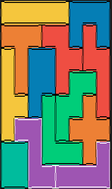

# Block Puzzle solver

On a family weekend I encountered a block puzzle that was designed for kids.
But me and some family members cracked our heads at it, and it was way more difficult than we thought.
Then we started wondering: how many solutions are there for this puzzle?
And of course, the only reasonable thing to do then, is to calculate all possible solutions.
So that is precisely what I did.
